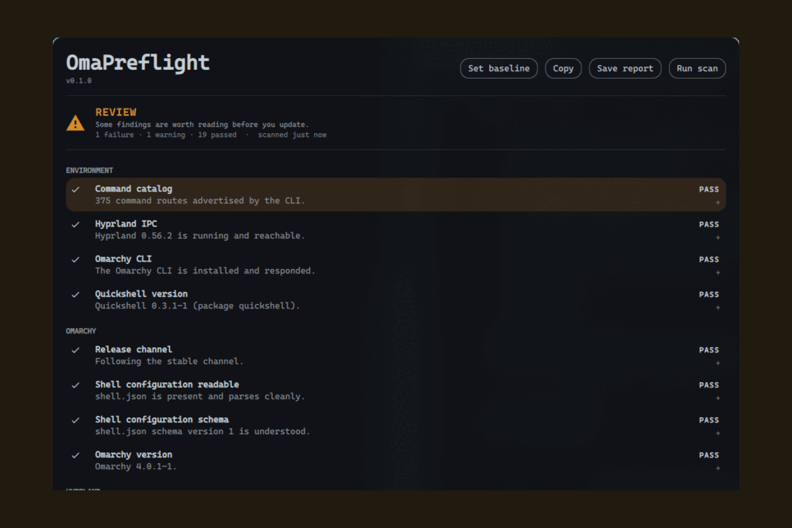

# OmaPreflight

**Check your system before updating. See what changed afterwards.**

OmaPreflight is an Omarchy-aware change-intelligence plugin. It establishes a
known-good picture of your system before a change, detects high-confidence
problems, and explains what is different afterwards — locally, read-only, with no
telemetry and no automatic fixes.

It does not replace `omarchy update`, snapshots, or your package manager. It is
the evidence layer around them.



*More in [screenshots/](screenshots/) — including a failing check expanded to
its evidence, and the bar widget's quick panel. Every colour is a theme token,
so it will look like whatever theme you have applied.*

> **Status: 0.1.1.** Twenty-one checks across environment, Omarchy, Hyprland,
> plugins, runtime and recovery; sanitized reports; baselines. Verified on
> Omarchy 4.0.1 / Quickshell 0.3.1 / Hyprland 0.56.2. See the
> [changelog](CHANGELOG.md) for what is in it and what is deliberately not.

The `main` branch also includes the optional [pre-update checklist](#optional-pre-update-checklist),
verified on Omarchy 4.0.2. It is off by default and uses a dedicated terminal
command; it does not intercept Omarchy's existing update commands or button.

## Design principles

- **Evidence over scores.** No "93% safe". Readiness is one of `READY`,
  `REVIEW`, `NOT_RECOMMENDED`, `UNKNOWN`, and every state traces to concrete
  check results.
- **Unknown is a valid answer.** Absence of evidence is never reported as safety.
- **Read-only by default.** It observes and explains. It does not change your
  system.
- **Local only.** No network access, ever. Reports are written to disk for you to
  review before sharing.

## Install

Review the source before enabling it — Omarchy plugins run unsandboxed inside
`omarchy-shell`.

```bash
omarchy plugin add https://github.com/p134c0d3/omarchy-omapreflight.git
```

Accept the prompt to enable it during installation. For an unattended install
from a repository you already trust:

```bash
omarchy plugin add https://github.com/p134c0d3/omarchy-omapreflight.git --enable --yes
```

The widget lands in the right bar section. Move it with:

```bash
omarchy bar move p134c0d3.omapreflight --section center
```

### Requirements

Omarchy, and the tools a stock Omarchy install already has. OmaPreflight bundles
nothing and installs nothing.

| Needed | Used for |
|---|---|
| `omarchy` | version, channel, plugin inventory and validation |
| `hyprctl` | config errors, bindings, monitors |
| `systemctl` | failed user services |
| `pacman` | the Quickshell version |
| `git` | local status inside plugin checkouts — never a fetch |
| `df`, `find`, `stat`, `dd`, `sha256sum`, `findmnt`, `mkdir` | free space, config metadata, bounded no-follow file reads, plugin directories |

Anything missing degrades one check to `SKIPPED` or `UNKNOWN` with the reason
shown. Nothing here is a hard dependency, and there are no bundled binaries and
no build step.

## Update

```bash
omarchy plugin update p134c0d3.omapreflight
omarchy plugin update --all
```

## Remove

```bash
omarchy plugin disable p134c0d3.omapreflight   # keep it installed, stop loading it
omarchy plugin remove p134c0d3.omapreflight    # remove it entirely
```

Removal takes the plugin out of `~/.config/omarchy/plugins/` and unloads it from
the running shell. It leaves nothing behind in your Omarchy or Hyprland
configuration, because it never wrote anything there.

Two things it created for itself are yours to delete if you want them gone:

```bash
rm -rf ~/.local/state/omapreflight    # baseline and saved reports
```

and the Hyprland window rule for its own report window, which is registered at
runtime and disappears on its own the next time the compositor restarts.

If you installed the optional terminal companion, remove its launcher too:

```bash
rm ~/.local/bin/omapreflight
```

## Use

- **Click the bar widget** for the quick panel: current readiness, what needs
  attention, when it last ran.
- **Open the full overlay** for the engineering surface:

  ```bash
  omarchy-shell shell toggle p134c0d3.omapreflight
  ```

  `Esc` closes it. Because the plugin declares an `overlay` kind, `summon`,
  `hide` and `toggle` route to the overlay — the quick panel is opened by
  clicking the widget.

Bind the overlay to a key in `~/.config/hypr/bindings.lua` if you want it on a
shortcut:

```lua
o.bind("SUPER, P", "OmaPreflight", "omarchy-shell shell toggle p134c0d3.omapreflight")
```

## Optional pre-update checklist

The terminal companion can run the full checklist before handing off to the
normal Omarchy updater. It requires Python 3; scanning also requires the
OmaPreflight plugin enabled in the running shell. Auto-run is **off by default**.

Install the companion command once, after installing/updating the plugin:

```bash
mkdir -p ~/.local/bin
ln -s "$HOME/.config/omarchy/plugins/p134c0d3.omapreflight/scripts/omapreflight" "$HOME/.local/bin/omapreflight"
```

Do not overwrite an existing command with the same name. Alternatively, run
`scripts/omapreflight` directly from this checkout.

```bash
omarchy plugin enable p134c0d3.omapreflight   # if the plugin is currently disabled
omapreflight auto-run enable
omapreflight pre-update         # test the checklist without launching an update
omapreflight update

omapreflight auto-run disable
omapreflight update              # straight to Omarchy; no preflight or IPC
omapreflight auto-run status
```

When enabled, the command acquires Omarchy's update lock, starts a fresh scan,
and prints every check. READY continues automatically. REVIEW asks whether to
continue, with “no” as the default. NOT RECOMMENDED and incomplete scans stop.
`omapreflight update -y` never prompts in preflight: REVIEW stops the command.
Informational warnings remain visible without blocking READY.

Before continuing, it saves the sanitized checklist and metadata baseline to
`${XDG_STATE_HOME:-~/.local/state}/omapreflight/pre-update.json`, separately from
your manual baseline. Failure to save stops the update. This is a pre-update
record, not proof that an update started or completed. Automatic postflight is
not implemented yet.

**Scope:** this version applies to `omapreflight update`. Ordinary
`omarchy update` and Omarchy's own update button remain unchanged. The installed
Omarchy has no native pre-update hook; no command overrides or system-package
changes are installed. `omapreflight pre-update` runs just the optional gate
without launching an update, which is useful for testing.

The checklist diagnoses the current system. It does not fetch pending package
versions, test candidate packages, or promise that future versions are compatible.
After the gate, Omarchy performs its normal update, including its own confirmation,
network access, snapshots, package handling, migrations, and restart decisions.

See the [usage and troubleshooting guide](docs/update-integration.md) and
[integration decision](docs/adr/ADR-008-optional-update-gate.md).

## IPC

The service registers the target `p134c0d3.omapreflight`:

```bash
omarchy-shell p134c0d3.omapreflight ping         # -> ok
omarchy-shell p134c0d3.omapreflight status       # -> JSON summary
omarchy-shell p134c0d3.omapreflight results      # -> JSON array of check results
omarchy-shell p134c0d3.omapreflight run          # run the check suite
omarchy-shell p134c0d3.omapreflight cancel       # stop a running scan
omarchy-shell p134c0d3.omapreflight report       # -> path of a written report

omarchy-shell p134c0d3.omapreflight togglePanel  # the bar quick panel
omarchy-shell p134c0d3.omapreflight openPanel
omarchy-shell p134c0d3.omapreflight closePanel

omarchy-shell shell toggle p134c0d3.omapreflight # the full overlay
```

Two things worth knowing. The overlay is what `shell toggle` opens, because the
manifest declares that kind — so the quick panel has its own methods. And those
methods live on the service rather than on the widget: one copy of the widget
exists per screen, so the service routes through the shell's own bar resolver,
which picks the instance on the focused output.

Bind either to a key in `~/.config/hypr/bindings.lua`:

```lua
hl.bind({ mods = "SUPER", key = "P", dispatcher = "exec",
          arg = "omarchy-shell p134c0d3.omapreflight togglePanel" })
```

The IPC surface is deliberately small. It runs no arbitrary commands and
returns only what a scan already collected. The companion additionally uses
`updateSnapshot <scan-id>` for an atomic completed checklist/baseline response
and `cancelScan <scan-id>` to cancel only its own scan. These IDs are compared
as data and never become executable commands.

## Theming

Every colour and metric comes from the active Omarchy theme's tokens
(`Color.*`, `Style.*`). There are no hard-coded colours and no light/dark
assumptions — switch themes and the plugin follows.

Status is never carried by colour alone. Every result has a glyph and a word
(`PASS`, `WARN`, `FAIL`, `UNKNOWN`, `SKIPPED`) before it has a tint, so the
whole surface stays legible with no colour perception at all.

## The report window

The full diagnostic surface is a real window, not a full-screen overlay. That
is deliberate: a layer-shell surface cannot be moved or resized, because
Omarchy binds `SUPER`+drag and `SUPER`+right-drag to *window* management and a
layer surface never receives them.

So it behaves like anything else on your desktop:

- `SUPER` + left-drag to move, `SUPER` + right-drag to resize;
- it opens floating and centred on the focused monitor;
- it sizes itself to its content, and only scrolls when the results genuinely
  do not fit on screen;
- `Esc` closes it, and it can stay open beside a terminal while you act on it.

Floating is the one thing a Wayland client cannot ask for on its own, so the
plugin registers a Hyprland window rule at runtime — named, scoped to its own
window by class and title, never written to any file, and gone when the
compositor restarts. If that fails the window still works; it is tiled instead
of floating. The reasoning is in
[ADR-005](docs/adr/ADR-005-window-not-layer-surface.md).

## What it does on your machine

Stated plainly, because you are running it unsandboxed:

The table describes the diagnostic plugin. The optional terminal companion
also reads `update-settings.json`, writes that preference and `pre-update.json`
inside its state directory, and opens Omarchy's native
`${XDG_RUNTIME_DIR:-/tmp}/omarchy-update.lock`. An explicit
`omapreflight update` invocation hands off to the normal updater after the gate;
Omarchy then owns its usual network, package, and privilege operations.

| Behaviour | Detail |
|---|---|
| **Commands run** | Read-only diagnostics only: `omarchy`, `hyprctl`, `systemctl --user`, `df`, `git status` inside plugin checkouts. Never `sudo`. Never an interactive command. |
| **Files read** | Two, for content: `~/.config/omarchy/shell.json` and OmaPreflight's own baseline. Each is opened no-follow, checked to be a regular file, and capped at 256 KiB. Approved `~/.config/hypr/*.lua` files are *measured* only — size, hash, mtime, never contents — as are plugin manifests. It never recursively scans `$HOME`. |
| **Files written** | Only `${XDG_STATE_HOME:-~/.local/state}/omapreflight/` — state, baseline, and reports you ask for. |
| **Network** | None. |
| **Compositor** | One runtime call: a named Hyprland window rule so the report window opens floating and centred. Scoped to this plugin's own window by class and title, never written to a file, gone when the compositor restarts. This is the only thing the plugin does that is not a read. |
| **Background work** | Runs inside the existing `omarchy-shell` process. No daemon, no second Quickshell instance, no systemd unit, no install hook. |
| **Privileges** | None. A diagnostic that would need privilege is reported as `SKIPPED — requires privilege`, with the manual command documented. |

### How the limits are enforced

Those are not promises, they are invariants with enforcement behind them:

- commands are argv arrays and there is no shell anywhere in the plugin, so
  there is nothing to quote and no injection to get wrong;
- any argument that came from outside the plugin — a plugin id, a directory
  name — is declared as data and validated: no leading dash (which is all
  argument injection needs), no control characters, and paths must be absolute,
  traversal-free, and inside an explicit root;
- exactly one file may start a process and exactly one may read a file, so the
  validation cannot be routed around;
- a read does not trust the path allowlist to say what is at a path: `stat`
  settles the file's type and size first, and the read itself is a `dd` opened
  with `O_NOFOLLOW` and `O_NONBLOCK` and bounded to 256 KiB, so a symlink, a
  FIFO or an oversized file at an approved path is refused by the kernel rather
  than followed, waited on, or swallowed;
- every command has a timeout and capped output, every check has a watchdog,
  and the whole scan has a ceiling.

`scripts/check` fails the build if any of that regresses. The reasoning, the
CWE mapping, and an honest list of what is *not* mitigated are in
[docs/security.md](docs/security.md). To report a vulnerability, see
[SECURITY.md](SECURITY.md).

[docs/privacy.md](docs/privacy.md) lists every value collected, where it comes
from, and what reaches disk.

## Documentation

| | |
|---|---|
| [Check catalog](docs/check-catalog.md) | All 21 checks, what each one runs, and what every outcome means |
| [Update integration](docs/update-integration.md) | Optional auto-run, checklist decisions, state files, and troubleshooting |
| [Privacy](docs/privacy.md) | Every value collected, its source, and what reaches disk |
| [Security model](docs/security.md) | Trust boundaries, enforced invariants, and the residual risks |
| [Architecture](docs/architecture.md) | How it fits together, and how to add a check |
| [Environment](docs/environment.md) | Verified Omarchy and Quickshell behaviour, including the traps |
| [Screenshots](screenshots/) | What it looks like, and how to reproduce them |
| [Decisions](docs/adr/) | ADRs: shared state, serial execution, pure-JS logic, theming, window vs layer surface |

## Development

```bash
scripts/check              # manifest validation + qmllint + security invariants
scripts/check --portable   # the subset that runs without Omarchy; this is CI
QT_QPA_PLATFORM=offscreen scripts/test  # Python companion tests + QML/JS tests
scripts/dev-install        # deploy to ~/.config/omarchy/plugins, restart the shell
```

`dev-install` restarts the shell deliberately: `service`-kind QML is served from
a cached component across a hot reload, so an edited `Service.qml` keeps running
its previous source until the shell process restarts. See
[docs/environment.md](docs/environment.md) for that and other verified runtime
behaviour.

## Licence

MIT — see [LICENSE](LICENSE).
